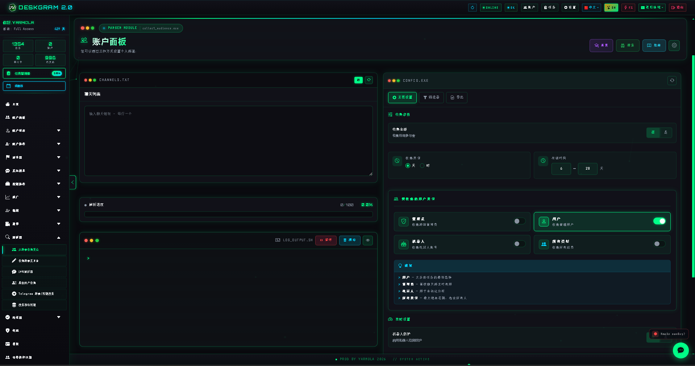
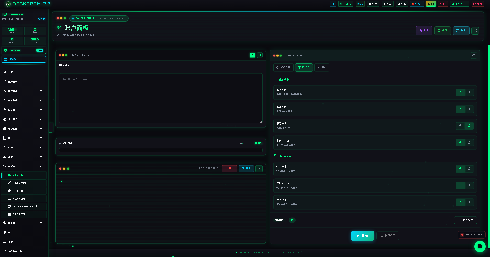
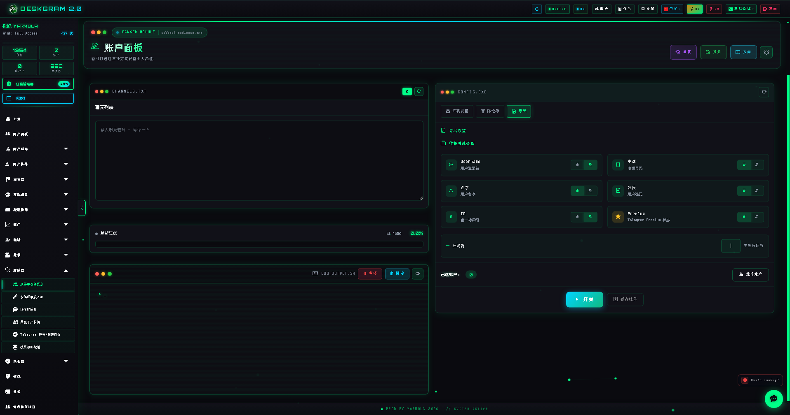

# Deskgram 2 受众收集

受众收集是 Deskgram 2 中用于从 Telegram 群组、聊天和相关来源整理用户基础的模块。它帮助你把后续私信、邀请和订阅场景需要的受众数据准备成可继续使用的结构。

[Deskgram 2 中文总览](https://github.com/Deskgram-2/deskgram-2-telegram-automation-zh) | [官网](https://deskgram2.com/) | [Telegram Bot](https://t.me/DG2welcomebot) | [Web Preview](https://deskgram2.com/web-preview)
## 交互式 Web Preview

在浏览器中体验这个模块: [打开 Web Preview](https://deskgram2.com/web-preview?path=%2Fapp-demo%2Ffunctions%2Fcollect_audience)

如果你想先判断这个模块是否适合当前场景，可以先打开 web preview，在浏览器里看看界面结构，再决定是否继续安装和配置。

## жЁЎеќ—з®Ђд»‹

| еЏ‚ж•° | е†…е®№ |
|---|---|
| 核心任务 | 从 Telegram 群组和聊天收集用户 |
| 收集对象 | 群成员、聊天活跃用户或其他相关来源 |
| 适用场景 | 私信触达、邀请流程、受众整理 |
| 关键价值 | 在执行前先拿到结构化受众基础 |
| 关联模块 | 私信群发、批量订阅 |

## жЁЎеќ—иѓЅеЉ›

- 从 Telegram 群组和聊天中收集用户；
- 对结果应用过滤条件；
- иѕ“е‡єйЂ‚еђ€еђЋз»­жµЃзЁ‹дЅїз”Ёзљ„еЏ—дј—еџєзЎЂпј›
- 为私信、邀请或订阅流程提供前置数据；
- 保留日志和执行结果。

## 快速开始

1. 选择来源群组、聊天或目标范围。
2. 配置过滤规则。
3. 运行收集流程并检查结果。
4. 将整理好的基础继续用于私信群发或批量订阅。

## 收集之后可以怎么走

- [私信群发](https://github.com/Deskgram-2/telegram-direct-messaging-deskgram-zh)，如果这批受众要进入私聊触达。
- [邀请模块](https://github.com/Deskgram-2/telegram-invite-tool-deskgram-zh)，如果这批基础将用于频道或群组增长。
- [账号面板](https://github.com/Deskgram-2/telegram-account-manager-deskgram-zh)，如果还需要整理执行账号层。
- [批量订阅](https://github.com/Deskgram-2/telegram-join-groups-deskgram-zh)，如果下一个阶段需要先准备环境。

## иї™йЎµењЁдё­ж–‡е·ҐдЅњжµЃй‡Њзљ„дЅЌзЅ®

- [代理管理](https://github.com/Deskgram-2/telegram-proxy-manager-deskgram-zh)，如果在执行前要先把基础设施整理好。
- [设置](https://github.com/Deskgram-2/telegram-automation-settings-deskgram-zh)，如果采集和后续执行依赖统一的系统环境。
- [任务管理器](https://github.com/Deskgram-2/telegram-task-manager-deskgram-zh)，如果你想把采集和下一步执行放在同一个控制层里。

## з•Њйќўдє®з‚№

### дё»з•Њйќў

### 过滤规则

### ж—Ґеї—дёЋз»“жћњ

## 适合在什么情况下使用

- еЅ“еђЋз»­е·ҐдЅњжµЃдѕќиµ–еЏЇз”Ёзљ„з”Ёж€·еџєзЎЂпј›
- 当你需要先收集再触达，而不是直接发送；
- 当你希望把受众整理和执行模块分开；
- 当多个场景需要复用同一批受众数据。

## 相比手动整理更方便的地方

| 手动方式 | Deskgram 2 受众收集 |
|---|---|
| 受众信息零散且难整理 | 模块输出结构化基础 |
| 过滤过程不稳定 | 过滤规则可重复使用 |
| 后续流程衔接麻烦 | 能直接连接到私信或订阅模块 |
| 重复收集效率低 | 工作流更适合持续使用 |

## 该选哪个：受众收集、评论受众收集，还是聊天活跃用户收集

| 如果你的目标是 | 更适合哪个 |
|---|---|
| 从群组和聊天里拿到更宽的用户基础 | [受众收集](https://github.com/Deskgram-2/telegram-audience-parser-deskgram-zh) |
| 获取更热的评论区用户 | [评论受众收集](https://github.com/Deskgram-2/telegram-comment-audience-parser-deskgram) |
| 锁定已经在聊天里发言的用户 | [聊天活跃用户收集](https://github.com/Deskgram-2/telegram-active-chat-users-parser-deskgram) |
| 为不同漏斗准备多个受众段 | 三种收集路径组合使用 |

## ењєж™Ї FAQ

### д»Ђд№€ж—¶еЂ™жЉЉеџєзЎЂйЂЃеЋ»з§ЃдїЎпјЊд»Ђд№€ж—¶еЂ™йЂЃеЋ»й‚ЂиЇ·пјџ

如果下一步是建立个人联系，更适合进入 [私信群发](https://github.com/Deskgram-2/telegram-direct-messaging-deskgram-zh)。如果目标是社区增长和导入群组或频道，更适合进入 [邀请模块](https://github.com/Deskgram-2/telegram-invite-tool-deskgram-zh)。

### 哪种基础通常表现更好？

更热的受众段通常来自评论区、活跃讨论和更明显的互动行为，在回复型流程里往往表现更好。但更宽的基础也很有价值，尤其是后续还会继续筛选时。

### 如果一开始还不知道该抓哪些来源怎么办？

那就先从 discovery 模块开始，比如 [频道与群组搜索](https://github.com/Deskgram-2/telegram-channel-search-deskgram-zh) 和 [相似频道搜索](https://github.com/Deskgram-2/telegram-similar-channels-deskgram-zh)。确定来源后再进入收集阶段会更顺。

## з›ёе…ід»“еє“

- [Deskgram 2 中文总览](https://github.com/Deskgram-2/deskgram-2-telegram-automation-zh)
- [з§ЃдїЎзѕ¤еЏ‘](https://github.com/Deskgram-2/telegram-direct-messaging-deskgram-zh)
- [批量订阅](https://github.com/Deskgram-2/telegram-join-groups-deskgram-zh)
- [й‚ЂиЇ·жЁЎеќ—](https://github.com/Deskgram-2/telegram-invite-tool-deskgram-zh)
- [账号面板](https://github.com/Deskgram-2/telegram-account-manager-deskgram-zh)
- [д»Јзђ†з®Ўзђ†](https://github.com/Deskgram-2/telegram-proxy-manager-deskgram-zh)
- [и®ѕзЅ®](https://github.com/Deskgram-2/telegram-automation-settings-deskgram-zh)
- [д»»еЉЎз®Ўзђ†е™Ё](https://github.com/Deskgram-2/telegram-task-manager-deskgram-zh)

## FAQ


### 可以先查看界面再决定是否安装吗？

可以。这个 README 里已经有直接的 web preview 链接，你可以先在浏览器中打开模块，看看界面和结构，再决定是否继续安装和配置账号。

### 收集完成后最自然的下一步是什么？

通常是进入私信群发或邀请场景。

### 这个模块只适合营销吗？

不只如此。只要后续流程依赖受众基础，它就有价值。
